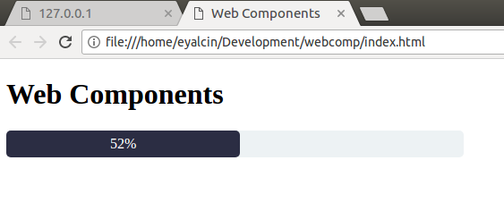

# es6-web-component
This refers to the attached youtube video and adapts the code to the current API standards.

Check the video if you need a first impression. Attached at the end.

Here is a basic progress-bar web-component with vanilla ES6.

## How to run this 

Click on the index.html file, tested with chrome so far :)

## My changes compared to the one in the video

I put the template into the constructor as shown in the google dev tutorials. I added the *slot* as a fallback but never used it. I put it there for consistency.

```js
    constructor(){
        super();

        this._complete = 0;
        const shadowRoot = this.attachShadow({mode: 'open'});
        
        shadowRoot.innerHTML = `
            <style>
                .progress-bar {
                    width: 50%;
                    height: 30px;
                    background-color: #EDF2F4;
                    border-radius: 5px;
                    color: white;
                }

                .progress-bar-inner {
                    height: 100%;
                    line-height: 30px;
                    background: #2B2D43;
                    text-align: center;
                    border-radius: 5px;
                    transition: width 0.25s;
                }
            </style>
            <slot></slot>
            <div class="progress-bar">
                <div class="progress-bar-inner">${this._complete}</div>
            </div>
        `;
    }
```
We add the shadow as const to the constructor and set the mode to open which means that the styling may be modified from outside. In other words your css stylesheet may change this element with this setting.

I removed the connectedCallback() function as I have seen that it was used for other stuff from the Google Devs. You can easily put the html into the connectedCallback() function, it does the same and works as well!
```js
not supported anymore!
const shadowRoot = this.ShadowRoot();
```
### Literature
https://developers.google.com/web/fundamentals/getting-started/primers/shadowdom
https://developers.google.com/web/fundamentals/getting-started/primers/customelements
https://www.youtube.com/watch?v=Tus_GVxyOtU&t=366s
